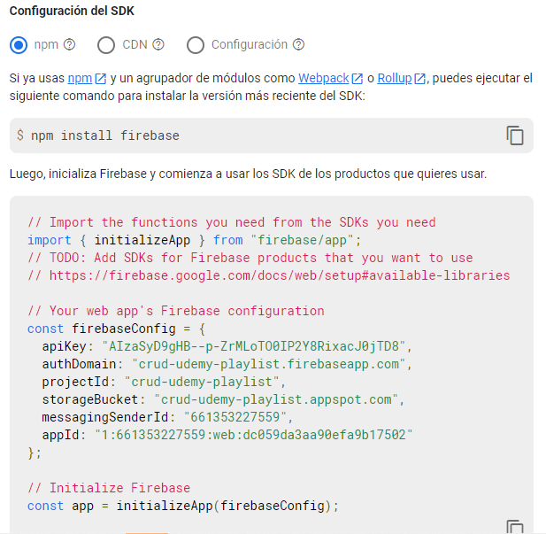

# CRUD FIREBASE

El proyecto playList CRUD, es un proyecto realizado en React, el cual consiste de una lista de reproducción de música. En el se desarrolla una interfaz grafica amable con el usuario para que el pueda agregar, editar o eliminar sus canciones favoritas. El aplicativo de playList fue desarrollado con los lenguajes de HTML, CSS, JavaScript, y con los frameworks de Bootstrap4.6 y React. Al mismo tiempo esta conectado con una base de datos realizada en fireBase en donde se almacena la información registrada por el usuario.

## Pasos a seguir para la ejecución del proyecto

1. > Clonamos el git con el comando:  
   > **git clone https://github.com/alejandraduque98/CrudFireBasePlayList.git**
2. > Accedemos a la carpeta con el comando:  
   > **cd CrudFireBasePlayList**
3. > Lo instalamoscon el comando:  
   > **npm install**
4. > Lo inicializamos con el comando:  
   > **npm run start\***

---

## Inicio del proyecto

| Interfaz                              | FireBase                                      |
| ------------------------------------- | --------------------------------------------- |
|  |  |

---

## Configuración en firebase

Primero realizamos una configuración del firebase y registramos la aplicación. Luego realizamos el llamado al fireStore para tener una conexión entre la base de datos y nuestro proyecto

## 

## Agregar

Se crea un estado en donde se almacene la información registrada por el usuario además creamos una función la cual lea la información ingresada y la envié al fireStore.
| Interfaz | FireBase |
| ---------------------------------------- | ------------- |
|  |  |
|  |  |

---

## Editar

En el creamos un estado que nos permita transformar el formulario para editar, y por medio de una función asíncrona traemos la información de la base de datos y actualizamos los campos
| Interfaz | FireBase |
| ---------------------------------------- | ------------- |
|  |  |

---

## Eliminar

Se crea una función flecha en la cual filtraremos la información ingresada por el usuario y a través del manejo de id, él nos permitirá saber que información filtrar y cual vamos a mostrar.

| Interfaz                                 | FireBase                                         |
| ---------------------------------------- | ------------------------------------------------ |
|   |  |
|  |                                                  |

# Tecnologías Usadas

| Tecnologías                              |               |
| ---------------------------------------- | ------------- |
|     | REACT         |
|         | JS            |
|        | CSS           |
|       | HTML          |
|  | Bootstrap 4.6 |
